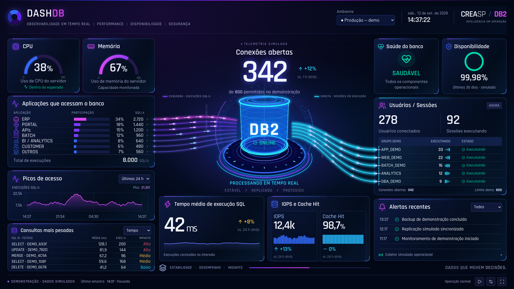

# DashDB

Dashboard de observabilidade em tempo real para bancos de dados. A interface usa React, TypeScript, Vite, Recharts e React Three Fiber; o serviço de coleta usa Python, FastAPI, SSE e o driver `ibm_db`.

O projeto inclui uma demonstração determinística e integração real com duas origens Db2 independentes: Linux/Huawei e AIX/Cirion. AIX/Cirion é a origem inicial do modo real. Endereços, usuários e senhas pertencem à configuração privada do ambiente e não são versionados.



**[Abrir demonstração online](https://marcelofp.github.io/DashDB/)** — versão estática com dados simulados, sem conexão com bancos reais.

## Executar a demonstração

Requer Node.js 22.12+ e npm 11+.

```sh
git clone https://github.com/marcelofp/DashDB.git
cd DashDB
npm ci
npm run dev
```

Abra [http://127.0.0.1:5173](http://127.0.0.1:5173). Alguns parâmetros úteis:

- `?seed=42&time=2026-09-12T17:37:22Z&freeze=1`: demonstração reproduzível.
- `?webgl=0`: força o núcleo em SVG.
- `?source=live`: consome a API real pelo proxy do Vite.
- `?db=huawei` ou `?db=cirion`: escolhe uma origem no modo real.

## Coletor real

```sh
python3 -m venv .venv
. .venv/bin/activate
pip install -r service/requirements.txt
cp service/db2.example.json service/db2.json
# Preencha service/db2.json somente no ambiente local; o arquivo é ignorado pelo Git.
CREDENTIALS_DIRECTORY="$PWD/service" STATE_DIRECTORY="$PWD/.state" PYTHONPATH=service uvicorn app:app --host 127.0.0.1 --port 8088
```

Em outro terminal:

```sh
VITE_DATA_MODE=live VITE_API_PROXY=http://127.0.0.1:8088 npm run dev
```

O serviço publica:

- `GET /api/sources`
- `GET /api/health?source=huawei|cirion`
- `GET /api/snapshot?source=huawei|cirion`
- `GET /api/events?source=huawei|cirion` por Server-Sent Events

As consultas são fixas e somente de monitoramento. A conexão aparece no Db2 como `APPLICATION_NAME=MonitorDash` e `CLIENT_APPLNAME=MonitorDash`. Para implantação com systemd, use [service/dashdb.service](service/dashdb.service) como modelo e entregue as credenciais por `LoadCredential`. Detalhes operacionais estão em [service/README.md](service/README.md).

## Adaptar para PostgreSQL, Oracle, SQL Server, MySQL ou outra base

O contrato visual é independente do mecanismo do banco. Um novo coletor deve produzir o mesmo `DashboardSample`, manter `null` quando a métrica não puder ser comprovada e preservar uma conexão e um histórico isolados por origem.

O roteiro completo para pessoas e agentes de IA está em [docs/ADAPTANDO-OUTROS-BANCOS.md](docs/ADAPTANDO-OUTROS-BANCOS.md). As regras curtas que uma IA deve seguir neste repositório estão em [AGENTS.md](AGENTS.md).

## Estrutura

| Caminho | Responsabilidade |
| --- | --- |
| `src/data/contracts.ts` | Contrato das amostras e métricas |
| `src/data/LiveDataSource.ts` | API, SSE e seleção da origem real |
| `src/data/MockDataSource.ts` | Demonstração determinística |
| `src/components/` | Painéis, tabelas e gráficos |
| `src/scene/` | Núcleo 3D e fluxos animados |
| `service/app.py` | API, isolamento das origens e SSE |
| `service/collector.py` | Consultas e normalização Db2 |
| `service/db2.example.json` | Modelo sem credenciais reais |
| `evidence/` | Capturas e validações locais da interface |

## Validação

```sh
npm run typecheck
npm test
PYTHONPATH=service python3 -m unittest discover -s service -v
npm run build
npm run test:e2e
```

O painel diferencia `0` de informação indisponível. Uma falha do coletor remove valores atuais, preserva o último histórico válido e nunca troca silenciosamente para dados simulados. O IOPS é calculado com os deltas dos contadores físicos de leitura e gravação observados pelo Db2.

## Publicação da demonstração

O workflow [`.github/workflows/pages.yml`](.github/workflows/pages.yml) cria um build exclusivo para o GitHub Pages com `VITE_DEMO_ONLY=true` e base `/DashDB/`. Cada atualização da branch `main` valida os testes unitários, gera `dist/` e publica a demonstração. Credenciais e o serviço Python não fazem parte do artefato estático.
